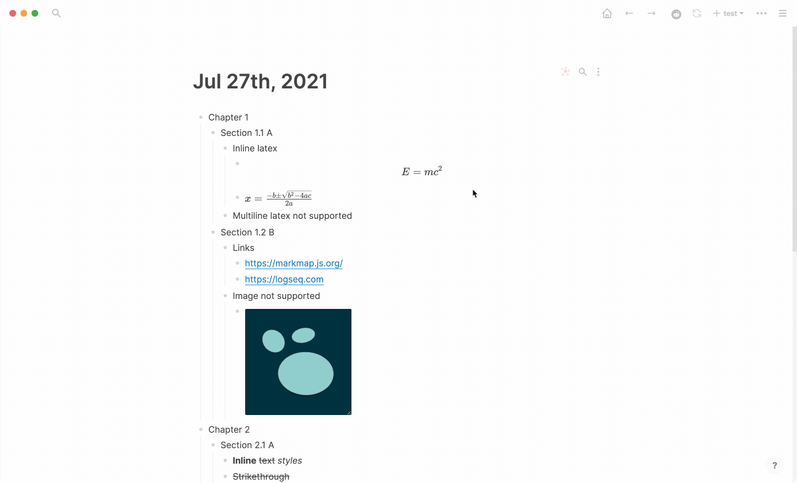

# Logseq Markmap Plugin

[](https://github.com/vipzhicheng/logseq-plugin-mark-map/releases)

**_Basic shortcuts_**



**_Traverse level by level and step by step_**


**_Focus in and out_**


This is a plugin for [Logseq](https://github.com/logseq/logseq) to provide mindmap support based on [Markmap](https://github.com/gera2ld/markmap).

## Installation and Usage

```
npm install
npm run build:prod # For real
npm run build # For development
```

Load unpack plugin from `dist` directory

## Stack

- Typescript
- TailwindCSS
- Alpine.js
- Markmap related packages

## Features

Most of features come from `Markmap` project.

- Colorful markmap items.
- Markmap toolbar included.
- Support inline code and code block.
- Support inline text styles.
- Support normal links.
- Support inline latex syntax.
- Support mouse drag and drop, double click, scrollwheel zoom.
- Provice many convenient shortcuts.
- Support dark mode, and up to 16 themes.
- Support Logseq block reference and page reference and page tag.
- Support highlight syntax `==` for Markdown, `^^` for Org mode.
- Workflow tags are Colorized.
- Image partly supported, will be converted to image link.
- Mainly support `Markdown` mode, `Org` mode partly supported.
- Support trigger markmap in block page.
- Support open next markmap in markmap.

## Notes

- The mindmap is not editable.
- Properies are ignored.
- Text length is unlimited.
- `#` head markdown syntax is ignored, use hierarchical blocks instead.
- Hiccup not supported.
- Tested on Logseq `v0.5.9`.

## Shortcuts

- `space`: fit window in center in case you move or zoom it.
- `0`: hide all except the central one.
- `9`: show all.
- `1`: expand to level 1.
- `2`: expand to level 2.
- `3`: expand to level 3.
- `4`: expand to level 4.
- `5`: expand to level 5.
- `+`: zoom in.
- `-`: zoom out.
- `h`: level up.
- `l`: level down.
- `j`: expand step by step.
- `k`: collapse step by step.
- `.`: focus in to children level.
- `b`: focus out to parent level.
- `,`: reset to original tree.
- `n`: focus to next sibling.
- `p`: focus to previous sibling.
- `r`: random change theme.
- `z`: reset theme according to Logseq theme.
- `ESC` & `q`: close the mindmap.
- `UP`: move mindmap up.
- `DOWN`: move mindmap down.
- `LEFT`: move mindmap left.
- `RIGHT`: move mindmap right.
- `cmd+[`: go backward.
- `cmd+]`: go forward.
- `/`: popup keybindings help model.

## Markmap trigger

- `m m`: trigger Markmap for non-editing mode, show currennt block and children when editing or highlighting, otherwise show all page blocks.
- `ctrl+m ctrl+m`: trigger Markmap for editing mode, show current block and children.
- `/Markmap` slash command: to trigger markmap for current block and children.
- `Markmap` contextual menu item: to trigger markmap for current block and children.
- Icon Button: to trigger markmap for current page.

## Markmap properties

### Page properties

- `mark-map-title:: blahblah`, to change the mindmap center node different from page title.
- `mark-map-collapsed`, a page property.
  - Without this property, mindmap will follow Logseq blocks collapsed state by default.
  - `mark-map-collapsed:: hidden`, to hide Logseq collapsed blocks on mindmap.
  - `mark-map-collapsed:: extend`, ignore Logseq blocks collapsed state, extend all nodes on mindmap.
- `mark-map-limit:: N`, to limit first level block list items.
- `mark-map-limit-all:: N`, to limit all block list items.

### Block properties

- `mark-map-display:: hidden`, a block property, to hide the block.
- `mark-map-cut:: 30`, a block property, to limit mindmap node text length.
- `mark-map-limit:: N`, to limit block next level block list items.

## FAQs

<details>
<summary>1. How to export high resolution image.</summary>
Once your markmap has huge blocks, the markmap will become so big and the default exported png become pixelated. And now it can export high resolution png but needs some special steps.

1. Click `+` to zoom in your markmap to maximum but not overflow.
2. Depend on your markmap's shape, if it looks like a landscape you need to move the markmap to left edge and if it looks like a portrait you need to move the markmap to top edge using arrow keys.
3. Click export button, the exported one will be high resolution, and the markmap will fit the window again.
</details>

## Contribution

Issues and PRs are welcome!

## Buy me a coffee

If my plugin solve your situation a little bit and you will, you can choose to buy me a coffee via [this](https://www.buymeacoffee.com/vipzhicheng) and [this](https://afdian.net/@vipzhicheng).

## Licence

MIT
